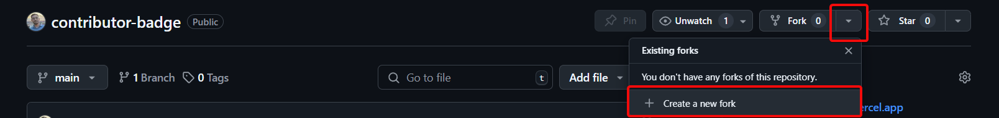
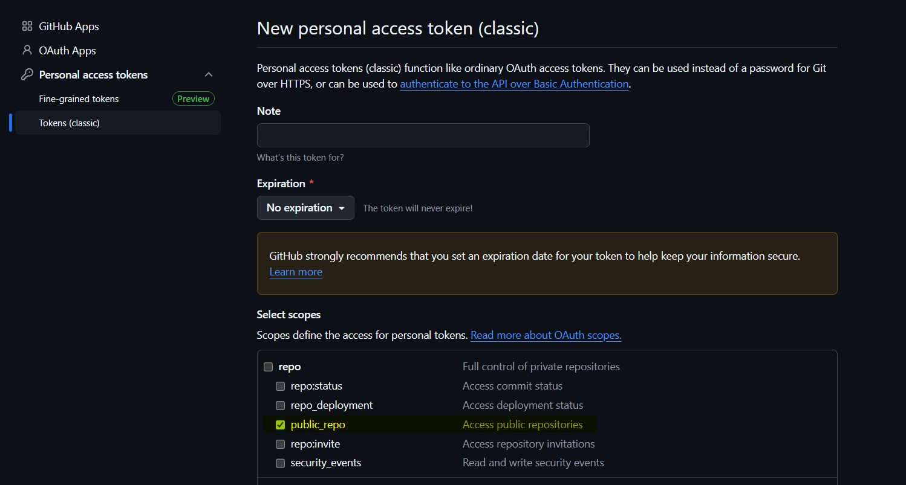
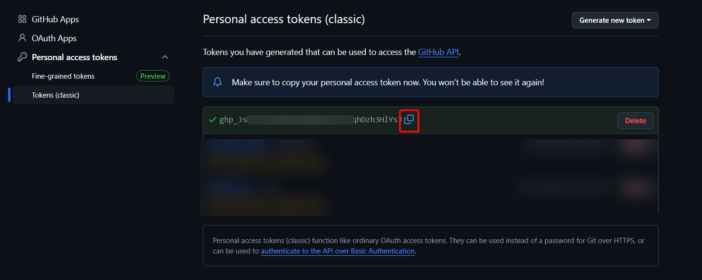
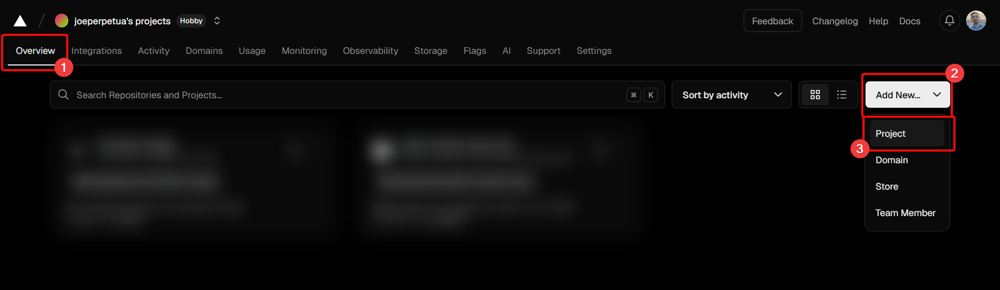
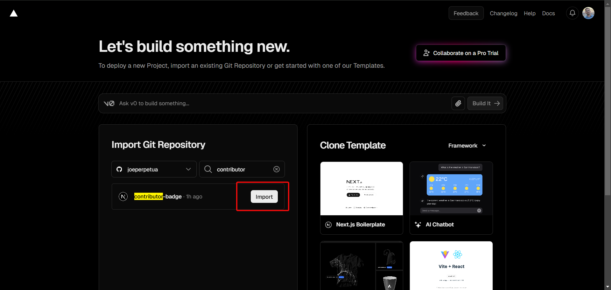
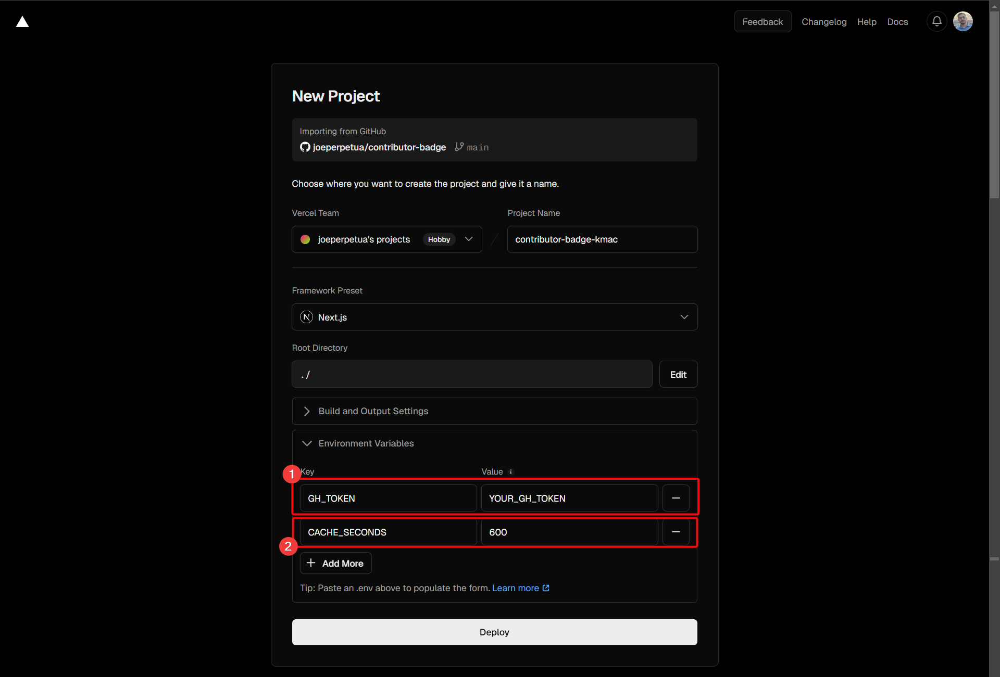

# Contributor Badge

<br>
Simple and customizable badges to showcase your OSS contributions  

in your Github profile or personal website.  
<br>

## Table of Contents
- [Usage](#usage)
- [Themes](#themes)
  - [Caveman](#caveman-default)
  - [EyeBurner](#eyeburner)
- [Display options](#display-options)
  - [showOwner](#showowner)
  - [borderRadius](#borderradius)
  - [transparent](#transparent)
  - [fontStyle](#fontstyle)
- [Deployment](#deployment)
- [Contributions](#contributions)

## Usage
The badges are served as SVG images, so they will need to be displayed by a `` or `<picture>` tag.
```html
     
```

You can set the size as you see fit using the `height` attribute and setting `width` to auto. 

You can add a custom link to the repository by wrapping the badge in a `<a>` tag:
```html
<a href="https://gihtub.com/REPO_OWNER/REPO_NAME" target="_blank"></a>
```

## Themes
You can choose any of the following themes by specifying the `theme` param in the URL:

### Caveman (default)
`&theme=caveman`  


### EyeBurner
`&theme=eyeBurner` 


## Display options
The following options can be set using query params:

### `showOwner`
Wether to display or not the repository owner.

`&showOwner=true` (default)  
  

`&showOwner=false`  


---

### `borderRadius`
Specify the border radius for the badge.

`&borderRadius=10` (default)  
  

`&borderRadius=0`    
  

---

### `transparent`
Wheter the badge has a solid background or not.

`&transparent=false` (default)  
  

`&transparent=true`  
  

---

### `fontStyle`
What font style to use. The badge will use websafe fonts for each OS/device, so the fonts used may differ depending where the badge is being served.

`&fontStyle=sans-serif` (default)  
  

`&fontStyle=serif`  
  

`&fontStyle=monospace`  
  

`&fontStyle=cursive`  
  

## Deployment
The current endpoint has a 12 hours cache to avoid reaching the Github API rate limiting.
You can deploy your own instance and set the CACHE_SECONDS environment variable to avoid this caching mechanism.

For this, you will need to create a fork of this repository and create an access token.

1. Create fork  


2. Create Github access token
  - Go to https://github.com/settings/tokens/new
  - Check the "public_repo" box
  
  - Scroll to the bottom of the page and click "Generate token"
  - Copy the token
  

3. Deploy in Vercel (or the provider you prefer)
   - Create account with Github in https://vercel.com
   - Create new Project
   
   - Import from your fork repository
   
   - Set the Environment variables `GH_TOKEN` and `CACHE_SECONDS`
   
   - Click "Deploy"

Now your deployment should be accessible in the URL created by Vercel.

## Contributions
Contributions are welcomed, feel free to create any issue or PR for further development.
Some nice features would be:
- More personalization options
- More themes
- Different locales
- Custom contribution types (issues, reviews, etc.)

